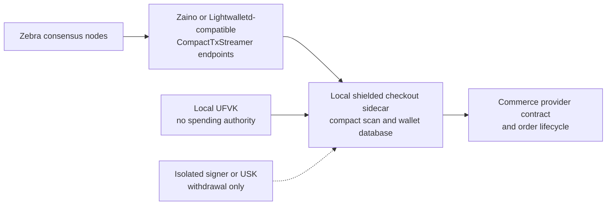

# Shielded ZEC Checkout

Shielded ZEC Checkout is a **shielded-only ZEC checkout provider and reference integration for self-hosted commerce**.

The project is an independent, community-built integration led by fengzie. It is not an official Zcash project and is not endorsed by the Electric Coin Company, the Zcash Foundation, or Zcash Community Grants.

## Scope

This repository starts with a narrow pre-application feasibility gate:

- derive a per-order Unified Address containing Orchard and Sapling receivers;
- fail closed if a transparent `p2pkh` or `p2sh` receiver is present;
- send a real testnet shielded payment from a pre-funded payer wallet;
- detect the merchant note and wait for confirmation;
- write a redacted, machine-readable transcript.

Transparent ZEC is never a fallback. A buyer-visible address must pass the receiver guard before it can be used.

The reference integration target is a merchant-operated standalone commerce node. Mobazha is the first integration host and a potential commercial user of the open-source work. This repository does not build or claim a hosted multi-tenant detector.

## Architecture

The default deployment is a local light-client sidecar, not a co-located full node. Consensus and compact-block services are shared or separately operated; merchant viewing capability, wallet state, address derivation, note detection, and order mapping stay local.



See [Long-term architecture](docs/architecture.md) for trust assumptions, key separation, endpoint policy, checkout events, and optional sovereign deployment.

## Status

Pre-application feasibility work only. The initial co-located Zebra and Zallet attempt was stopped before payment and superseded by a light-client architecture. The repository does not yet claim a real testnet checkout result, production backend, restart recovery, withdrawal support, complete failure-path coverage, or third-party reproduction. See [the current feasibility record](docs/feasibility.md).

## Quick start

Requirements:

- Python 3.11 or newer;
- no wallet backend or network access for the local unit tests.

Run local tests:

```bash
make test
```

The existing RPC harness and full-node runbook are preserved as superseded first-attempt evidence. Do not use them as the current backend direction. A replacement light-client gate must pass the same receiver, network, confirmation, and redaction invariants before any real result is claimed.

## Documentation

- [Prior work ledger](docs/prior-work.md)
- [Long-term architecture](docs/architecture.md)
- [Backend and version decision](docs/backend-decision.md)
- [Archived full-node testnet runbook](docs/testnet-runbook.md)
- [Feasibility gate and blocker](docs/feasibility.md)
- [Transcript schema](docs/transcript-schema.md)
- [Security policy](SECURITY.md)
- [Contributing](CONTRIBUTING.md)

## License

Apache License 2.0 applies to the contents of this repository. The prior-work ledger cites unpublished private work for provenance only; no historical source code is included in or licensed through this repository.
