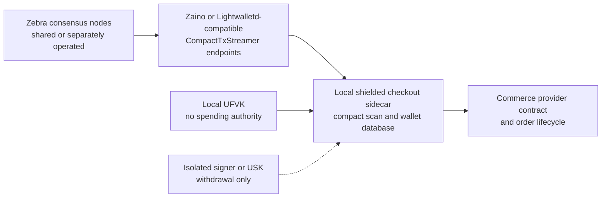

# Long-term architecture

Status: accepted architectural direction on 2026-07-14. One light-client testnet feasibility run passed; no production backend is claimed.

## Decision

A merchant checkout deployment must not require a co-located Zcash full node. Consensus nodes and compact-block indexers belong to a shared or separately operated chain-data layer. The merchant-operated checkout sidecar keeps wallet state and performs shielded note detection locally.

A consensus node still exists behind each trustworthy chain-data service, but it is not a per-merchant runtime dependency. The default checkout sidecar downloads compact shielded data from a wallet birthday, maintains a small local wallet database, and trial-decrypts notes locally.

## Trust and key boundaries

### Chain-data service

The remote service supplies network identity, chain tip, compact blocks, tree state, full transactions when required, and transaction broadcast. It must never receive a merchant viewing key, spending key, derived address list, or order mapping.

The light-client protocol assumes the service provides a faithful view of the best chain. A default production profile should compare independently operated endpoints and fail closed on network, tip, recent block-hash, or tree-state disagreement. This comparison improves fault detection but is not equivalent to locally validating consensus.

### Online detector

The merchant-operated sidecar holds the Unified Full Viewing Key and wallet database. It can derive diversified addresses, detect incoming notes, track nullifiers, and reconcile confirmations without holding spending authority. It continuously scans a common compact-block range instead of querying the remote service for a buyer address.

The detector persists its wallet birthday, scan cursor, recent chain state, note state, and emitted event identifiers. Restart recovery resumes from the persisted cursor and replays idempotently.

### Isolated signer

The Unified Spending Key or mnemonic belongs in a separate signer or explicitly unlocked withdrawal workflow. Guest Checkout collection and confirmation do not require it. A disposable feasibility wallet may combine detection and spending, but that is not the production key boundary.

## Checkout lifecycle

1. Derive a unique Unified Address for each order.
2. Inspect the encoded receivers before exposure. Orchard-only or Orchard plus Sapling is allowed; `p2pkh`, `p2sh`, transparent, and unknown receiver types fail closed.
3. Store the order-to-diversified-address mapping locally. Do not send it to the compact-block endpoint.
4. Scan compact blocks locally and match decrypted notes to the order.
5. Emit idempotent `detected`, `mined`, `confirmed`, and `reorged` provider events.
6. Advance the commerce order only after the configured shielded confirmation policy passes.

Endpoint unavailability, endpoint disagreement, stale chain data, an incomplete wallet scan, an unsupported network upgrade, or a receiver-guard failure makes the shielded rail unavailable. None of these conditions permits a transparent ZEC fallback.

## Deployment profiles

| Profile | Checkout sidecar | Chain-data source | Intended use |
|---|---|---|---|
| Default standalone | Local light-client sidecar | Multiple configurable public or commercial endpoints | Primary reference deployment |
| Private infrastructure | Local light-client sidecar | Merchant-selected private Zaino or compatible service | Privacy-sensitive operators |
| Sovereign | Local light-client sidecar | Merchant-operated Zebra plus Zaino | Optional maximum-control deployment |
| Contract-compatible SaaS | Same provider contract | Deployment-specific | Contract compatibility only in this funding round; no hosted multi-tenant detector |

Running Zebra and Zaino is therefore an optional infrastructure profile, not a requirement for every checkout installation.

## Ecosystem alignment

This boundary follows the established mobile-wallet pattern. Zashi/Zodl uses
the official Zcash Android wallet SDK, while Zingo Mobile uses ZingoLib; both
families keep wallet keys and compact-block scanning in the client and consume
a remote light-client service. A full consensus node remains behind the service
but is not synchronized separately by every phone or merchant checkout.

The current Ironwood testnet transition does not invalidate that architecture.
It exposed a version-readiness gap: stable and ordinary development wallet
builds lagged the testnet activation, while an exact feature branch could scan
Ironwood notes. The passed gate still required a local fee-accounting patch, so
production adoption must wait for reviewed upstream packaging.

## Implementation boundary

The provider should target the CompactTxStreamer light-client contract rather than a specific server implementation. Zaino and Lightwalletd-compatible services can then be selected or replaced without changing the commerce integration.

For feasibility, a pinned ZingoLib wallet is the leading candidate because it already implements Orchard-capable light-client scanning and transaction construction. A production sidecar should embed a reviewed Rust wallet library, using Zcash wallet primitives such as `zcash_client_backend` and `zcash_client_sqlite` directly or through a maintained higher-level wallet engine. Shelling out to an interactive wallet CLI is not the long-term provider boundary.

## Privacy limitations

Compact-block trial decryption keeps addresses and keys local, but a remote service can still observe client IP addresses, connection timing, requested block ranges, and requests for individual full transactions. Fixed-cadence scanning, batched transaction retrieval, independent endpoints, and privacy-preserving transport are future hardening options. These limitations must be disclosed; the sidecar must not claim full-node-equivalent consensus assurance or network anonymity.

## References

- [ZIP 307: Light Client Protocol for Payment Detection](https://zips.z.cash/zip-0307)
- [Zcash Rust wallet crates](https://github.com/zcash/librustzcash)
- [Zaino](https://github.com/zingolabs/zaino)
- [ZingoLib](https://github.com/zingolabs/zingolib)
- [Zcash Android wallet SDK](https://github.com/zcash/zcash-android-wallet-sdk)
- [Zodl Android wallet](https://github.com/zodl-inc/zodl-android)
- [Zingo Mobile](https://github.com/zingolabs/zingo-mobile)
